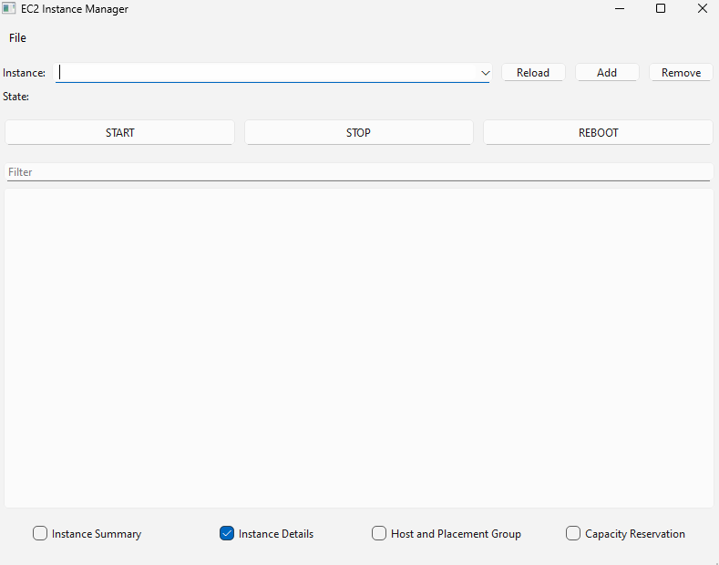

# EC2-Instance-Manager
A simple GUI tool for managing EC2 instances on Windows.

## Building the source
The following steps assume you have MSVC 2022, Qt MSVC 2022 libraries (added to path), [AWS CPP SDK](https://docs.aws.amazon.com/sdk-for-cpp/v1/developer-guide/setup-windows.html), CMake, and CMake generator set to MSVC 2022.

1. Edit line 78 & 80 of `/CMakeLists.txt` to include the path of your AWS CPP SDK for both configurations. For reference, path subfolders should have `/bin, /include, /lib`.
2. Run `mkdir build && cd build`.
3. Run `cmake -DCMAKE_PREFIX_PATH=PATH -DCMAKE_BUILD_TYPE=Release ..` where `PATH` is the location of your Qt libraries' cmake files (ex: `C:\Qt\6.8.2\msvc2022_64\lib\cmake\Qt6`).
4. Run `cmake --build . --config=Release`.
5. The executable should be in the `Release` folder. Copy all AWS .dlls from the build directory into the folder. Run `cd Release`.
6. Run `windeployqt EC2-Instance-Manager.exe`.

## Usage
This application requires the use of the Default AWS Credentials Provider Chain to authenticate calls with the AWS SDK. If you're able to make requests with the AWS CLI, chances are you're good to go!

## License
This project is licensed under the terms of the [GNU Lesser General Public License v3.0](https://www.gnu.org/licenses/lgpl-3.0.en.html). The LGPL v3.0 and GPL v3.0 licenses are also included in this repository respectively in files `COPYING.LESSER` and `COPYING`.